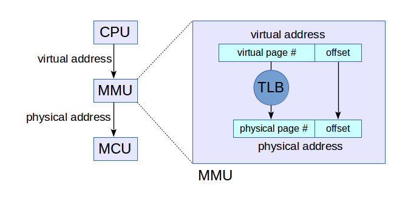

# Chapter 3 — Virtual memory

## 3.1 A bit of information theory

A **bit** is a binary digit; it is also a unit of information. If you have one
bit, you can specify one of two possibilities, usually written 0 and 1. If you
have two bits, there are 4 possible combinations, 00, 01, 10, and 11. In
general, if you have *b* bits, you can indicate one of 2<sup>*b*</sup>
values. A **byte** is 8 bits, so it can hold one of 256 values.

Going in the other direction, suppose you want to store a letter of the
alphabet. There are 26 letters, so how many bits do you need? With 4 bits, you
can specify one of 16 values, so that's not enough. With 5 bits, you can
specify up to 32 values, so that's enough for all the letters, with a few
values left over.

In general, if you want to specify one of *N* values, you should choose the
smallest value of *b* so that 2<sup>*b*</sup> ≥ *N*. Taking the log base 2 of
both sides yields *b* ≥ log<sub>2</sub>*N*.

Suppose I flip a coin and tell you the outcome. I have given you one bit of
information. If I roll a six-sided die and tell you the outcome, I have given
you log<sub>2</sub>6 bits of information. And in general, if the probability
of the outcome is 1 in *N*, then the outcome contains log<sub>2</sub>*N* bits
of information.

Equivalently, if the probability of the outcome is *p*, then the information
content is −log<sub>2</sub>*p*. This quantity is called the
**self-information** of the outcome. It measures how surprising the outcome
is, which is why it is also called **surprisal**. If your horse has only one
chance in 16 of winning, and he wins, you get 4 bits of information (along
with the payout). But if the favorite wins 75% of the time, the news of the
win contains only 0.42 bits.

Intuitively, unexpected news carries a lot of information; conversely, if
there is something you were already confident of, confirming it contributes
only a small amount of information.

For several topics in this book, we will need to be comfortable converting
back and forth between the number of bits, *b*, and the number of values they
can encode, *N* = 2<sup>*b*</sup>.

## 3.2 Memory and storage

While a process is running, most of its data is held in **main memory**, which
is usually some kind of random access memory (RAM). On most current computers,
main memory is **volatile**, which means that when the computer shuts down,
the contents of main memory are lost. A typical desktop computer has 2–8 GiB
of memory. GiB stands for "gibibyte," which is 2<sup>30</sup> bytes.

If the process reads and writes files, those files are usually stored on a
hard disk drive (HDD) or solid state drive (SSD). These storage devices are
**non-volatile**, so they are used for long-term storage. Currently a typical
desktop computer has a HDD with a capacity of 500 GB to 2 TB. GB stands for
"gigabyte," which is 10<sup>9</sup> bytes. TB stands for "terabyte," which is
10<sup>12</sup> bytes.

You might have noticed that I used the binary unit GiB for the size of main
memory and the decimal units GB and TB for the size of the HDD. For historical
and technical reasons, memory is measured in binary units, and disk drives are
measured in decimal units. In this book I will be careful to distinguish
binary and decimal units, but you should be aware that the word "gigabyte" and
the abbreviation GB are often used ambiguously.

In casual use, the term "memory" is sometimes used for HDDs and SSDs as well
as RAM, but the properties of these devices are very different, so we will
need to distinguish them. I will use **storage** to refer to HDDs and SSDs.

## 3.3 Address spaces

Each byte in main memory is specified by an integer **physical address**. The
set of valid physical addresses is called the **physical address space**. It
usually runs from 0 to *N* − 1, where *N* is the size of main memory. On a
system with 1 GiB of physical memory, the highest valid address is
2<sup>30</sup> − 1, which is 1,073,741,823 in decimal, or `0x3fff ffff` in
hexadecimal (the prefix `0x` indicates a hexadecimal number).

However, most operating systems provide **virtual memory**, which means that
programs never deal with physical addresses, and don't have to know how much
physical memory is available.

Instead, programs work with **virtual addresses**, which are numbered from 0
to *M* − 1, where *M* is the number of valid virtual addresses. The size of
the virtual address space is determined by the operating system and the
hardware it runs on.

You have probably heard people talk about 32-bit and 64-bit systems. These
terms indicate the size of the registers, which is usually also the size of a
virtual address. On a 32-bit system, virtual addresses are 32 bits, which
means that the virtual address space runs from 0 to `0xffff ffff`. The size of
this address space is 2<sup>32</sup> bytes, or 4 GiB.

On a 64-bit system, the size of the virtual address space is 2<sup>64</sup>
bytes, or 2<sup>4</sup> · 1024<sup>6</sup> bytes. That's 16 exbibytes, which
is about a billion times bigger than current physical memories. It might seem
strange that a virtual address space can be so much bigger than physical
memory, but we will see soon how that works.

When a program reads and writes values in memory, it generates virtual
addresses. The hardware, with help from the operating system, translates to
physical addresses before accessing main memory. This translation is done on a
per-process basis, so even if two processes generate the same virtual address,
they would map to different locations in physical memory.

Thus, virtual memory is one important way the operating system isolates
processes from each other. In general, a process cannot access data belonging
to another process, because there is no virtual address it can generate that
maps to physical memory allocated to another process.

## 3.4 Memory segments

The data of a running process is organized into five **segments**:

- The **code segment** contains the program text; that is, the machine
  language instructions that make up the program.

- The **static segment** contains immutable values, like string literals. For
  example, if your program contains the string `"Hello, World"`, those
  characters will be stored in the static segment.

- The **global segment** contains global variables and local variables that
  are declared `static`.

- The **heap segment** contains chunks of memory allocated at run time, most
  often by calling the C library function `malloc`.

- The **stack segment** contains the call stack, which is a sequence of stack
  frames. Each time a function is called, a stack frame is allocated to
  contain the parameters and local variables of the function. When the
  function completes, its stack frame is removed from the stack.

The arrangement of these segments is determined partly by the compiler and
partly by the operating system. The details vary from one system to another,
but in the most common arrangement:

- The text segment is near the "bottom" of memory, that is, at addresses near
  0.

- The static segment is often just above the text segment, that is, at higher
  addresses.

- The global segment is often just above the static segment.

- The heap is often above the global segment. As it expands, it grows up
  toward larger addresses.

- The stack is near the top of memory; that is, near the highest addresses in
  the virtual address space. As the stack expands, it grows down toward
  smaller addresses.

To determine the layout of these segments on your system, try running this
program, which is in `aspace.c` in the repository for this book (see
Section 0.1).

```c
#include <stdio.h>
#include <stdlib.h>

int global;

int main ()
{
    int local = 5;
    void *p = malloc(128);
    char *s = "Hello, World";

    printf ("Address of main is %p\n", main);
    printf ("Address of global is %p\n", &global);
    printf ("Address of local is %p\n", &local);
    printf ("p points to %p\n", p);
    printf ("s points to %p\n", s);
}
```

`main` is the name of a function; when it is used as a variable, it refers to
the address of the first machine language instruction in `main`, which we
expect to be in the text segment.

`global` is a global variable, so we expect it to be in the global segment.
`local` is a local variable, so we expect it to be on the stack.

`s` refers to a "string literal", which is a string that appears as part of
the program (as opposed to a string that is read from a file, input by a user,
etc.). We expect the location of the string to be in the static segment (as
opposed to the pointer, `s`, which is a local variable).

`p` contains an address returned by `malloc`, which allocates space in the
heap. "malloc" stands for "memory allocate."

The format sequence `%p` tells `printf` to format each address as a
"pointer", so it displays the results in hexadecimal.

When I run this program, the output looks like this (I added spaces to make it
easier to read):

```
Address of main is 0x   40057d
Address of global is 0x   60104c
Address of local is 0x7ffe6085443c
p points to 0x  16c3010
s points to 0x   4006a4
```

As expected, the address of `main` is the lowest, followed by the location of
the string literal. The location of `global` is next, then the address `p`
points to. The address of `local` is much bigger.

The largest address has 12 hexadecimal digits. Each hex digit corresponds to 4
bits, so it is a 48-bit address. That suggests that the usable part of the
virtual address space is 2<sup>48</sup> bytes.

As an exercise, run this program on your computer and compare your results to
mine. Add a second call to `malloc` and check whether the heap on your system
grows up (toward larger addresses). Add a function that prints the address of
a local variable, and check whether the stack grows down.

## 3.5 Static local variables

Local variables on the stack are sometimes called **automatic**, because they
are allocated automatically when a function is called, and freed automatically
when the function returns.

In C there is another kind of local variable, called **static**, which is
allocated in the global segment. It is initialized when the program starts and
keeps its value from one function call to the next.

For example, the following function keeps track of how many times it has been
called.

```c
int times_called()
{
    static int counter = 0;
    counter++;
    return counter;
}
```

The keyword `static` indicates that `counter` is a static local variable. The
initialization happens only once, when the program starts.

If you add this function to `aspace.c` you can confirm that `counter` is
allocated in the global segment along with global variables, not in the stack.

## 3.6 Address translation

How does a virtual address (VA) get translated to a physical address (PA)? The
basic mechanism is simple, but a simple implementation would be too slow and
take too much space. So actual implementations are a bit more complicated.

Most processors provide a memory management unit (MMU) that sits between the
CPU and main memory. The MMU performs fast translation between VAs and PAs.

1. When a program reads or writes a variable, the CPU generates a VA.

2. The MMU splits the VA into two parts, called the page number and the
   offset. A "page" is a chunk of memory; the size of a page depends on the
   operating system and the hardware, but common sizes are 1–4 KiB.

3. The MMU looks up the page number in the translation lookaside buffer (TLB)
   and gets the corresponding physical page number. Then it combines the
   physical page number with the offset to produce a PA.

4. The PA is passed to main memory, which reads or writes the given location.

The TLB contains cached copies of data from the page table (which is stored in
kernel memory). The page table contains the mapping from virtual page numbers
to physical page numbers. Since each process has its own page table, the TLB
has to make sure it only uses entries from the page table of the process
that's running.

Figure 3.1 shows a diagram of this process. To see how it all works, suppose
that the VA is 32 bits and the physical memory is 1 GiB, divided into 1 KiB
pages.



*Figure 3.1: Diagram of the address translation process.*

- Since 1 GiB is 2<sup>30</sup> bytes and 1 KiB is 2<sup>10</sup> bytes, there
  are 2<sup>20</sup> physical pages, sometimes called "frames."

- The size of the virtual address space is 2<sup>32</sup> B and the size of a
  page is 2<sup>10</sup> B, so there are 2<sup>22</sup> virtual pages.

- The size of the offset is determined by the page size. In this example the
  page size is 2<sup>10</sup> B, so it takes 10 bits to specify a byte on a
  page.

- If a VA is 32 bits and the offset is 10 bits, the remaining 22 bits make up
  the virtual page number.

- Since there are 2<sup>20</sup> physical pages, each physical page number is
  20 bits. Adding in the 10 bit offset, the resulting PAs are 30 bits.

So far this all seems feasible. But let's think about how big a page table
might have to be. The simplest implementation of a page table is an array with
one entry for each virtual page. Each entry would contain a physical page
number, which is 20 bits in this example, plus some additional information
about each frame. So we expect 3–4 bytes per entry. But with 2<sup>22</sup>
virtual pages, the page table would require 2<sup>24</sup> bytes, or 16 MiB.

And since we need a page table for each process, a system running 256
processes would need 2<sup>32</sup> bytes, or 4 GiB, just for page tables!
And that's just with 32-bit virtual addresses. With 48- or 64-bit VAs, the
numbers are ridiculous.

Fortunately, we don't actually need that much space, because most processes
don't use even a small fraction of their virtual address space. And if a
process doesn't use a virtual page, we don't need an entry in the page table
for it.

Another way to say the same thing is that page tables are "sparse", which
implies that the simple implementation, an array of page table entries, is a
bad idea. Fortunately, there are several good implementations for sparse
arrays.

One option is a **multilevel page table**, which is what many operating
systems, including Linux, use. Another option is an **associative table**,
where each entry includes both the virtual page number and the physical page
number. Searching an associative table can be slow in software, but in
hardware we can search the entire table in parallel, so associative arrays are
often used to represent the page table entries in the TLB.

You can read more about these implementations at
http://en.wikipedia.org/wiki/Page_table; you might find the details
interesting. But the fundamental idea is that page tables are sparse, so we
have to choose a good implementation for sparse arrays.

I mentioned earlier that the operating system can interrupt a running process,
save its state, and then run another process. This mechanism is called a
**context switch**. Since each process has its own page table, the operating
system has to work with the MMU to make sure each process gets the right page
table. In older machines, the page table information in the MMU had to be
replaced during every context switch, which was expensive. In newer systems,
each page table entry in the MMU includes the process ID, so page tables from
multiple processes can be in the MMU at the same time.

---

Chapter-3 from https://github.com/AllenDowney/ThinkOS
