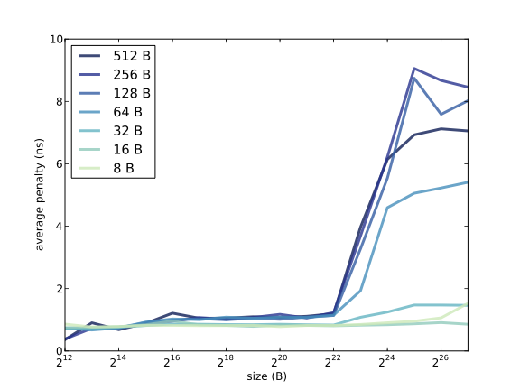

# Chapter 7 — Caching

## 7.1 How programs run

In order to understand caching, you have to understand how computers execute
programs. For a deep understanding of this topic, you should study computer
architecture. My goal in this chapter is to provide a simple model of program
execution.

When a program starts, the code (or text) is usually on a hard disk or solid
state drive. The operating system creates a new process to run the program,
then the "loader" copies the text from storage into main memory and starts the
program by calling `main`.

While the program is running, most of its data is stored in main memory, but
some of the data is in registers, which are small units of memory on the CPU.
These registers include:

- The **program counter**, or PC, which contains the address (in memory) of
  the next instruction in the program.

- The **instruction register**, or IR, which contains the machine code
  instruction currently executing.

- The **stack pointer**, or SP, which contains the address of the stack frame
  for the current function, which contains its parameters and local variables.

- General-purpose registers that hold the data the program is currently
  working with.

- A **status register**, or **flag register**, that contains information about
  the current computation. For example, the flag register usually contains a
  bit that is set if the result of the previous operation was zero.

When a program is running, the CPU executes the following steps, called the
"instruction cycle":

- **Fetch:** The next instruction is fetched from memory and stored in the
  instruction register.

- **Decode:** Part of the CPU, called the "control unit", decodes the
  instruction and sends signals to the other parts of the CPU.

- **Execute:** Signals from the control unit cause the appropriate computation
  to occur.

Most computers can execute a few hundred different instructions, called the
"instruction set". But most instructions fall into a few general categories:

- **Load:** Transfers a value from memory to a register.

- **Arithmetic/logic:** Loads operands from registers, performs a mathematical
  operation, and stores the result in a register.

- **Store:** Transfers a value from a register to memory.

- **Jump/branch:** Changes the program counter, causing the flow of execution
  to jump to another location in the program. Branches are usually
  conditional, which means that they check a flag in the flag register and
  jump only if it is set.

Some instructions sets, including the ubiquitous x86, provide instructions
that combine a load and an arithmetic operation.

During each instruction cycle, one instruction is read from the program text.
In addition, about half of the instructions in a typical program load or store
data. And therein lies one of the fundamental problems of computer
architecture: the "memory bottleneck".

In current computers, a typical core is capable of executing an instruction in
less than 1 ns. But the time it takes to transfer data to and from memory is
about 100 ns. If the CPU has to wait 100 ns to fetch the next instruction, and
another 100 ns to load data, it would complete instructions 200 times slower
than what's theoretically possible. For many computations, memory is the speed
limiting factor, not the CPU.

## 7.2 Cache performance

The solution to this problem, or at least a partial solution, is caching. A
"cache" is a small, fast memory that is physically close to the CPU, usually on
the same chip.

Actually, current computers typically have several levels of cache: the Level 1
cache, which is the smallest and fastest, might be 1–2 MiB with a access times
near 1 ns; the Level 2 cache might have access times near 4 ns, and the Level 3
might take 16 ns.

When the CPU loads a value from memory, it stores a copy in the cache. If the
same value is loaded again, the CPU gets the cached copy and doesn't have to
wait for memory.

Eventually the cache gets full. Then, in order to bring something new in, we
have to kick something out. So if the CPU loads a value and then loads it
again much later, it might not be in cache any more.

The performance of many programs is limited by the effectiveness of the cache.
If the instructions and data needed by the CPU are usually in cache, the
program can run close to the full speed of the CPU. If the CPU frequently needs
data that are not in cache, the program is limited by the speed of memory.

The cache "hit rate", *h*, is the fraction of memory accesses that find data in
cache; the "miss rate", *m*, is the fraction of memory accesses that have to go
to memory. If the time to process a cache hit is T<sub>h</sub> and the time for
a cache miss is T<sub>m</sub>, the average time for each memory access is

*h* T<sub>h</sub> + *m* T<sub>m</sub>

Equivalently, we could define the "miss penalty" as the extra time to process a
cache miss, T<sub>p</sub> = T<sub>m</sub> − T<sub>h</sub>. Then the average
access time is

T<sub>h</sub> + *m* T<sub>p</sub>

When the miss rate is low, the average access time can be close to T<sub>h</sub>.
That is, the program can perform as if memory ran at cache speeds.

## 7.3 Locality

When a program reads a byte for the first time, the cache usually loads a
"block" or "line" of data that includes the requested byte and some of its
neighbors. If the program goes on to read one of the neighbors, it will already
be in cache.

As an example, suppose the block size is 64 B; you read a string with length
64, and the first byte of the string happens to fall at the beginning of a
block. When you load the first byte, you incur a miss penalty, but after that
the rest of the string will be in cache. After reading the whole string, the
hit rate will be 63/64, about 98%. If the string spans two blocks, you would
incur 2 miss penalties. But even then the hit rate would be 62/64, or almost
97%. If you then read the same string again, the hit rate would be 100%.

On the other hand, if the program jumps around unpredictably, reading data from
scattered locations in memory, and seldom accessing the same location twice,
cache performance would be poor.

The tendency of a program to use the same data more than once is called
"temporal locality". The tendency to use data in nearby locations is called
"spatial locality". Fortunately, many programs naturally display both kinds of
locality:

- Most programs contain blocks of code with no jumps or branches. Within these
  blocks, instructions run sequentially, so the access pattern has spatial
  locality.

- In a loop, programs execute the same instructions many times, so the access
  pattern has temporal locality.

- The result of one instruction is often used immediately as an operand of the
  next instruction, so the data access pattern has temporal locality.

- When a program executes a function, its parameters and local variables are
  stored together on the stack; accessing these values has spatial locality.

- One of the most common processing patterns is to read or write the elements
  of an array sequentially; this pattern also has spatial locality.

The next section explores the relationship between a program's access pattern
and cache performance.

## 7.4 Measuring cache performance

When I was a graduate student at U.C. Berkeley I was a teaching assistant for
Computer Architecture with Brian Harvey. One of my favorite exercises involved
a program that iterates through an array and measures the average time to read
and write an element. By varying the size of the array, it is possible to infer
the size of the cache, the block size, and some other attributes.

My modified version of this program is in the `cache` directory of the
repository for this book (see Section 0.1).

The important part of the program is this loop:

```c
iters = 0;
do {
    sec0 = get_seconds();

    for (index = 0; index < limit; index += stride)
        array[index] = array[index] + 1;

    iters = iters + 1;
    sec = sec + (get_seconds() - sec0);

} while (sec < 0.1);
```

The inner `for` loop traverses the array. `limit` determines how much of the
array it traverses; `stride` determines how many elements it skips over. For
example, if `limit` is 16 and `stride` is 4, the loop would access elements 0,
4, 8, and 12.

`sec` keeps track of the total CPU time used by the inner loop. The outer loop
runs until `sec` exceeds 0.1 seconds, which is long enough that we can compute
the average time with sufficient precision.

`get_seconds` uses the system call `clock_gettime`, converts to seconds, and
returns the result as a `double`:

```c
double get_seconds(){
    struct timespec ts;
    clock_gettime(CLOCK_PROCESS_CPUTIME_ID, &ts);
    return ts.tv_sec + ts.tv_nsec / 1e9;
}
```

To isolate the time to access the elements of the array, the program runs a
second loop that is almost identical except that the inner loop doesn't touch
the array; it always increments the same variable:

```c
iters2 = 0;
do {
    sec0 = get_seconds();

    for (index = 0; index < limit; index += stride)
        temp = temp + index;

    iters2 = iters2 + 1;
    sec = sec - (get_seconds() - sec0);

} while (iters2 < iters);
```



*Figure 7.1: Average miss penalty as a function of array size and stride.*

The second loop runs the same number of iterations as the first. After each
iteration, it subtracts the elapsed time from `sec`. When the loop completes,
`sec` contains the total time for all array accesses, minus the total time it
took to increment `temp`. This difference is the total miss penalty incurred by
all accesses. Finally, we divide by the number of accesses to get the average
miss penalty per access, in ns:

```c
sec * 1e9 / iters / limit * stride
```

If you compile and run `cache.c` you should see output like this:

```
Size: 4096 Stride: 8 read+write: 0.8633 ns
Size: 4096 Stride: 16 read+write: 0.7023 ns
Size: 4096 Stride: 32 read+write: 0.7105 ns
Size: 4096 Stride: 64 read+write: 0.7058 ns
```

If you have Python and matplotlib installed, you can use `graph_data.py` to
graph the results. Figure 7.1 shows the results when I ran it on a Dell
Optiplex 7010. Notice that the array size and stride are reported in bytes, not
number of array elements.

Take a minute to consider this graph, and see what you can infer about the
cache. Here are some things to think about:

- The program reads through the array many times, so it has plenty of temporal
  locality. If the entire array fits in cache, we expect the average miss
  penalty to be near 0.

- When the stride is 4 bytes, we read every element of the array, so the
  program has plenty of spatial locality. If the block size is big enough to
  contain 64 elements, for example, the hit rate would be 63/64, even if the
  array does not fit in cache.

- If the stride is equal to the block size (or greater), the spatial locality
  is effectively zero, because each time we read a block, we only access one
  element. In that case we expect to see the maximum miss penalty.

In summary, we expect good cache performance if the array is smaller than the
cache size or if the stride is smaller than the block size. Performance only
degrades if the array is bigger than the cache and the stride is large.

In Figure 7.1, cache performance is good, for all strides, as long as the array
is less than 2<sup>22</sup> B. We can infer that the cache size is near 4 MiB;
in fact, according to the specs, it is 3 MiB.

When the stride is 8, 16, or 32 B, cache performance is good. At 64 B it starts
to degrade, and for larger strides the average miss penalty is about 9 ns. We
can infer that the block size near 128 B.

Many processors use "multi-level caches" that include a small, fast cache and a
bigger, slower cache. In this example, it looks like the miss penalty increases
a little when the array size is bigger than 2<sup>14</sup> B, so it's possible
that this processor also has a 16 KB cache with an access time less than 1 ns.

## 7.5 Programming for cache performance

Memory caching is implemented in hardware, so most of the time programmers
don't need to know much about it. But if you know how caches work, you can
write programs that use them more effectively.

For example, if you are working with a large array, it might be faster to
traverse the array once, performing several operations with each element,
rather than traversing the array several times.

If you are working with a 2-D array, it might be stored as an array of rows. If
you traverse through the elements, it would be faster to go row-wise, with
stride equal to the element size, rather than column-wise, with stride equal to
the row length.

Linked data structures don't always exhibit spatial locality, because the nodes
aren't necessarily contiguous in memory. But if you allocate many nodes at the
same time, they are usually co-located in the heap. Or, even better, if you
allocate an array of nodes all at once, you know they will be contiguous.

Recursive strategies like mergesort often have good cache behavior because they
break big arrays into smaller pieces and then work with the pieces. Sometimes
these algorithms can be tuned to take advantage of cache behavior.

For applications where performance is critical, it is possible to design
algorithms tailored to the size of the cache, the block size, and other
hardware characterstics. Algorithms like that are called "cache-aware". The
obvious drawback of cache-aware algorithms is that they are hardware-specific.

## 7.6 The memory hierarchy

At some point during this chapter, a question like the following might have
occurred to you: "If caches are so much faster than main memory, why not make a
really big cache and forget about memory?"

Without going too far into computer architecture, there are two reasons:
electronics and economics. Caches are fast because they are small and close to
the CPU, which minimizes delays due to capacitance and signal propagation. If
you make a cache big, it will be slower.

Also, caches take up space on the processor chip, and bigger chips are more
expensive. Main memory is usually dynamic random-access memory (DRAM), which
uses only one transistor and one capacitor per bit, so it is possible to pack
more memory into the same amount of space. But this way of implementing memory
is slower than the way caches are implemented.

Also main memory is usually packaged in a dual in-line memory module (DIMM)
that includes 16 or more chips. Several small chips are cheaper than one big
one.

The trade-off between speed, size, and cost is the fundamental reason for
caching. If there were one memory technology that was fast, big, and cheap, we
wouldn't need anything else.

The same principle applies to storage as well as memory. Solid state drives
(SSD) are fast, but they are more expensive than hard drives (HDD), so they
tend to be smaller. Tape drives are even slower than hard drives, but they can
store large amounts of data relatively cheaply.

The following table shows typical access times, sizes, and costs for each of
these technologies.

| Device   | Access time | Typical size | Cost         |
|----------|-------------|--------------|--------------|
| Register | 0.5 ns      | 256 B        | ?            |
| Cache    | 1 ns        | 2 MiB        | ?            |
| DRAM     | 100 ns      | 4 GiB        | $ 10 / GiB   |
| SSD      | 10 µs       | 100 GiB      | $ 1 / GiB    |
| HDD      | 5 ms        | 500 GiB      | $ 0.25 / GiB |
| Tape     | minutes     | 1–2 TiB      | $ 0.02 / GiB |

The number and size of registers depends on details of the architecture.
Current computers have about 32 general-purpose registers, each storing one
"word". On a 32-bit computer, a word is 32 bits or 4 B. On a 64-bit computer, a
word is 64 bits or 8 B. So the total size of the register file is 100–300 B.

The cost of registers and caches is hard to quantify. They contribute to the
cost of the chips they are on, but consumers don't see that cost directly.

For the other numbers in the table, I looked at the specifications for typical
hardware for sale from online computer hardware stores. By the time you read
this, these numbers will be obsolete, but they give you an idea of what the
performance and cost gaps looked like at one point in time.

These technologies make up the "memory hierarchy" (note that this use of
"memory" also includes storage). Each level of the hierarchy is bigger and
slower than the one above it. And in some sense, each level acts as a cache for
the one below it. You can think of main memory as a cache for programs and data
that are stored permanently on SSDs and HHDs. And if you are working with very
large datasets stored on tape, you could use hard drives to cache one subset of
the data at a time.

## 7.7 Caching policy

The memory hierarchy suggests a framework for thinking about caching. At every
level of the hierarchy, we have to address four fundamental questions of
caching:

- **Who moves data up and down the hierarchy?** At the top of the hierarchy,
  register allocation is usually done by the compiler. Hardware on the CPU
  handles the memory cache. Users implicitly move data from storage to memory
  when they execute programs and open files. But the operating system also
  moves data back and forth between memory and storage. At the bottom of the
  hierarchy, administrators move data explicitly between disk and tape.

- **What gets moved?** In general, block sizes are small at the top of the
  hierarchy and bigger at the bottom. In a memory cache, a typical block size
  is 128 B. Pages in memory might be 4 KiB, but when the operating system
  reads a file from disk, it might read 10s or 100s of blocks at a time.

- **When does data get moved?** In the most basic cache, data gets moved into
  cache when it is used for the first time. But many caches use some kind of
  "prefetching", meaning that data is loaded before it is explicitly
  requested. We have already seen one form of prefetching: loading an entire
  block when only part of it is requested.

- **Where in the cache does the data go?** When the cache is full, we can't
  bring anything in without kicking something out. Ideally, we want to keep
  data that will be used again soon and replace data that won't.

The answers to these questions make up the "cache policy". Near the top of the
hierarchy, cache policies tend to be simple because they have to be fast and
they are implemented in hardware. Near the bottom of the hierarchy, there is
more time to make decisions, and well-designed policies can make a big
difference.

Most cache policies are based on the principle that history repeats itself; if
we have information about the recent past, we can use it to predict the
immediate future. For example, if a block of data has been used recently, we
expect it to be used again soon. This principle suggests a replacement policy
called "least recently used," or LRU, which removes from the cache a block of
data that has not been used recently. For more on this topic, see
http://en.wikipedia.org/wiki/Cache_algorithms.

## 7.8 Paging

In systems with virtual memory, the operating system can move pages back and
forth between memory and storage. As I mentioned in Section 6.2, this
mechanism is called "paging" or sometimes "swapping".

Here's how the process works:

1. Suppose Process A calls `malloc` to allocate a chunk. If there is no free
   space in the heap with the requested size, `malloc` calls `sbrk` to ask the
   operating system for more memory.

2. If there is a free page in physical memory, the operating system adds it to
   the page table for Process A, creating a new range of valid virtual
   addresses.

3. If there are no free pages, the paging system chooses a "victim page"
   belonging to Process B. It copies the contents of the victim page from
   memory to disk, then it modifies the page table for Process B to indicate
   that this page is "swapped out".

4. Once the data from Process B is written, the page can be reallocated to
   Process A. To prevent Process A from reading Process B's data, the page
   should be cleared.

5. At this point the call to `sbrk` can return, giving `malloc` additional
   space in the heap. Then `malloc` allocates the requested chunk and returns.
   Process A can resume.

6. When Process A completes, or is interrupted, the scheduler might allow
   Process B to resume. When Process B accesses a page that has been swapped
   out, the memory management unit notices that the page is "invalid" and
   causes an interrupt.

7. When the operating system handles the interrupt, it sees that the page is
   swapped out, so it transfers the page back from disk to memory.

8. Once the page is swapped in, Process B can resume.

When paging works well, it can greatly improve the utilization of physical
memory, allowing more processes to run in less space. Here's why:

- Most processes don't use all of their allocated memory. Many parts of the
  text segment are never executed, or execute once and never again. Those
  pages can be swapped out without causing any problems.

- If a program leaks memory, it might leave allocated space behind and never
  access it again. By swapping those pages out, the operating system can
  effectively plug the leak.

- On most systems, there are processes like daemons that sit idle most of the
  time and only occasionally "wake up" to respond to events. While they are
  idle, these processes can be swapped out.

- A user might have many windows open, but only a few are active at a time. The
  inactive processes can be swapped out.

- Also, there might be many processes running the same program. These
  processes can share the same text and static segments, avoiding the need to
  keep multiple copies in physical memory.

If you add up the total memory allocated to all processes, it can greatly
exceed the size of physical memory, and yet the system can still behave well.

Up to a point.

When a process accesses a page that's swapped out, it has to get the data back
from disk, which can take several milliseconds. The delay is often noticeable.
If you leave a window idle for a long time and then switch back to it, it might
start slowly, and you might hear the disk drive working while pages are swapped
in.

Occasional delays like that might be acceptable, but if you have too many
processes using too much space, they start to interfere with each other. When
Process A runs, it evicts the pages Process B needs. Then when B runs, it
evicts the pages A needs. When this happens, both processes slow to a crawl and
the system can become unresponsive. This scenario is called "thrashing".

In theory, operating systems could avoid thrashing by detecting an increase in
paging and blocking or killing processes until the system is responsive again.
But as far as I can tell, most systems don't do this, or don't do it well; it
is often left to users to limit their use of physical memory or try to recover
when thrashing occurs.

---

Chapter-7 from https://github.com/AllenDowney/ThinkOS
